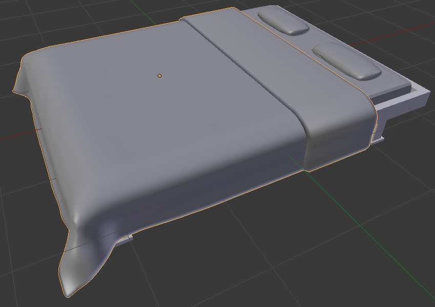
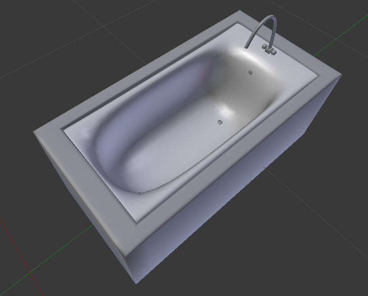
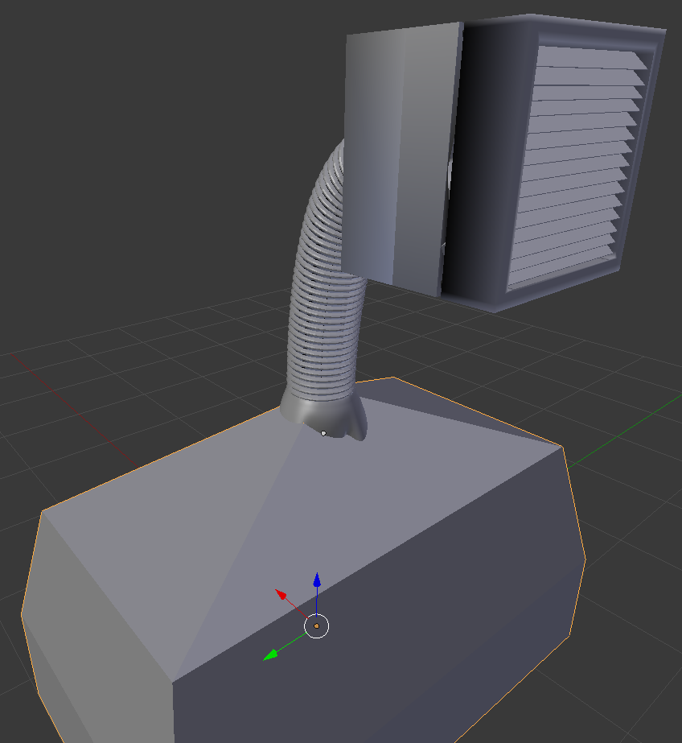
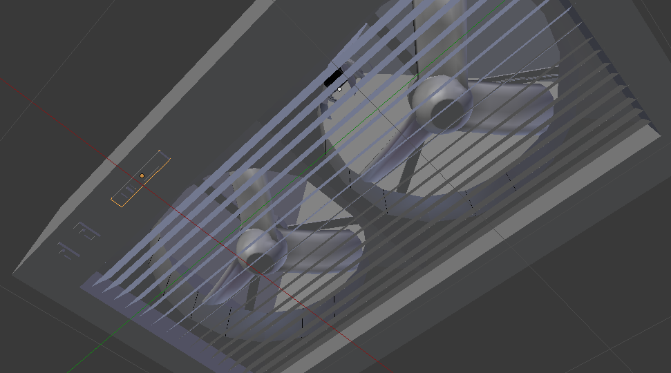
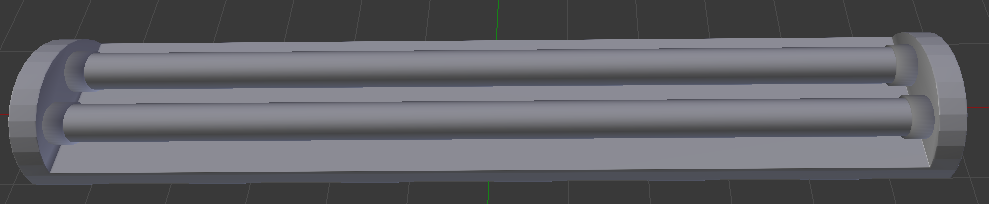
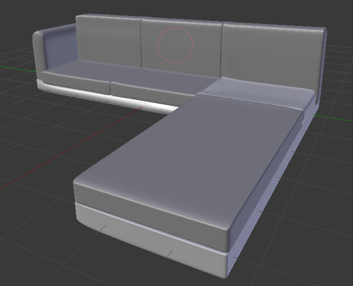
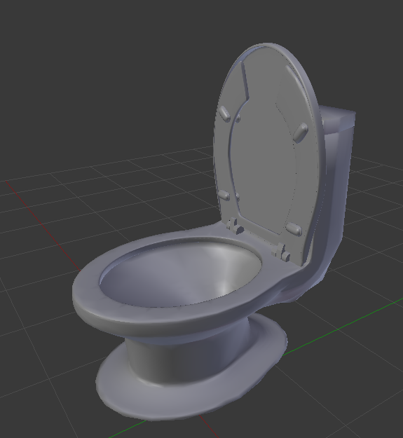
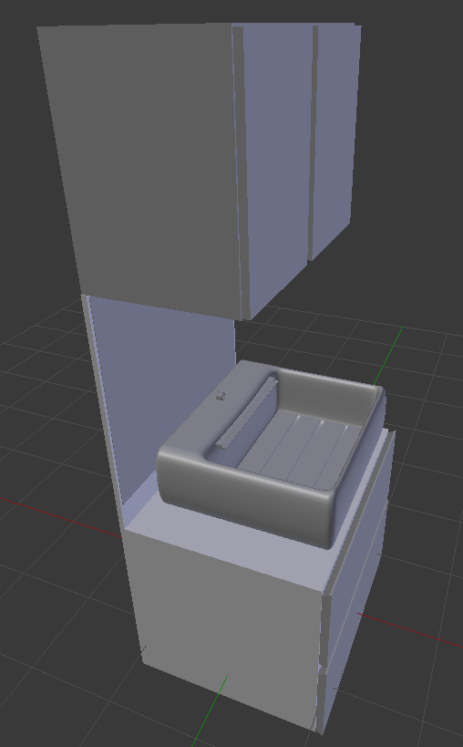
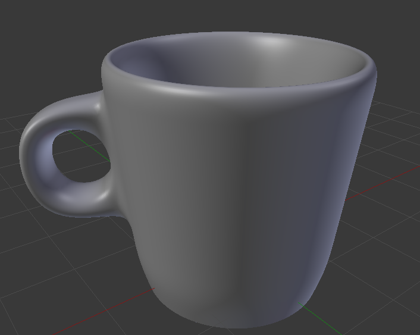
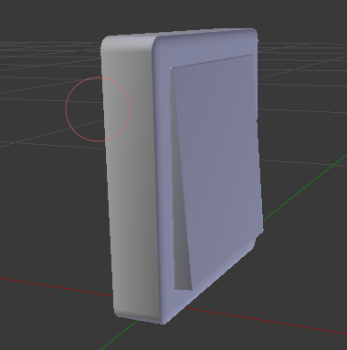

# My-blender-3d-model
Some 3d models I made by using the blender. 
## Index
### [Models](#model)
### [License](#licen)

<h3 id="model"> Models</h3>
BedA.blend, a bed:
  

bathtubA.blend, a bathtub:
  

kitchenExhaustfanA.blend, an Exhaustfan:
  
button of ExhaustfanA.blend
  

lightA, a fluorescent light (tube type) without a glass shield:
  

sofaA, a big sofa:
  

tolientA, a toilet seat:
  

washtabletsetA, a wash table with cabinet:
  

cupA.blend, a cup:
  

switchA, a simple electrical switch:
  

  
<h3 id="licen"> License</h3>
All models in this repository were released under Attribution 4.0 International (CC BY 4.0)
